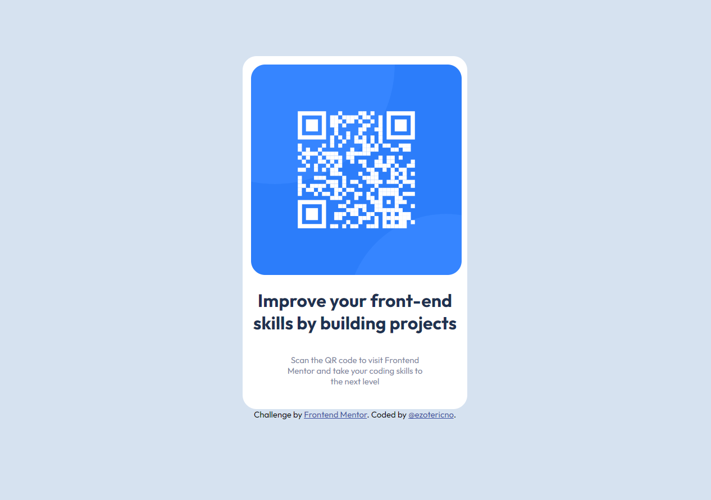

# Frontend Mentor - QR code component solution

This is a solution to the [QR code component challenge on Frontend Mentor](https://www.frontendmentor.io/challenges/qr-code-component-iux_sIO_H). Frontend Mentor challenges help you improve your coding skills by building realistic projects. 

## Table of contents

- [Overview](#overview)
  - [Screenshot](#screenshot)
  - [Links](#links)
- [My process](#my-process)
  - [Built with](#built-with)
  - [What I learned](#what-i-learned)
  - [Continued development](#continued-development)
  - [Useful resources](#useful-resources)
- [Author](https://github.com/ezotericno)
- [Acknowledgments](#acknowledgments)

## Overview

### Screenshot



### Links

- [Solution URL](https://github.com/ezotericno/fem-qrcode)
- [Live Site URL](https://ezotericno.github.io/fem-qrcode/)

## My process

This is technically my second attempt of this challenge. I ended up scrapping my first attempt and starting completely over, this time I took a step-by-step approach.
The first go around I was working for hours and was not able to produce something close to a solution. I took a couple days break, then decided to start all over from scratch. I started off editing the html file and sorting things to make it more readable in a side-by-side window in Github Codespaces. After the html file setup, I begun creating my scss files and started Live Sass Compiler. I separated my Sass veriables and basic configurations into their own files and used ``` @import ``` to get them into the main. Once everything was setup it was time to style everything was Sass. It took a good amount of time getting things to the right shape and lined up properly, but eventually I had everything pretty good. 

### Built with

- HTML
- Sass
- Github Codespaces
  - Extensions used:
    - Live Sass compiler
    - Live Server
    - Prettier

### What I learned

Building off of just a screenshot takes a lot of work and research. [This website](https://www.w3docs.com/) was a huge help during the whole process. I wanted to see how far
I could get with just my initial knowledge at first, then I begun looking at the former website for things I did not know how to do. Doing this taught me a lot about the workflow and how setting up your coding envirornment is one of the keys to success.

### Continued development

Looking ahead, I would like to try and use Python for my next challenge. HTML and CSS/Sass are great, but the coding language I started learning first was Python and I would like to coninue on that journey and see what I can make and learn things like Django and Flask. This project may not seem like much, but for me it was a long journey to get it to where it is today. I feel way more confident now in what I can do, and I know if I put my mind to it I can figure things out and achieve more and make something even better next time. 

### Useful resources

- [W3 Docs](https://www.w3docs.com/) - This website was my main source of tutorials when it came to CSS styling
- [W3 Schools](www.w3schools.com) - I used this as a secondary resource with learning how to use flex and alignment with items

## Author

- Website - [Anthony Pritchard](https://github.com/ezotericno)
- Frontend Mentor - [@ezotericno](https://www.frontendmentor.io/profile/ezotericno)
- Twitter - [@EZOtericno](https://www.twitter.com/ezotericno)

## Acknowledgments

Big shoutout to [@thecodercoder](https://github.com/thecodercoder), I was first introduced to her content via the [freeCodeCamp.org's](https://www.youtube.com/@freecodecamp) YouTube videos. While watching some of the html and CSS/Sass videos I got interested in learning web-development, watching her made me wonder if I could do something like that. Web-development is hard! But very satisfying once you get things right and working properly.
